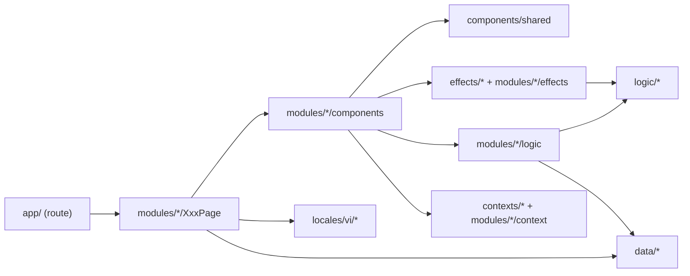

# ARCHITECTURE – "Dấu Chân Kinh Bắc" (sau refactor 2026-10-04)

Tài liệu quy ước cho `dau-chan-kinh-bac/src`. Đọc trước khi thêm trang / component mới.

## 1. Cây thư mục & trách nhiệm

```
src/
├── app/                 # ROUTE MỎNG: chỉ metadata (+ generateStaticParams/notFound) rồi render <XxxPage/>
├── modules/<module>/    # Tính năng theo trang
│   ├── <Module>Page.js  #   Server Component lắp ráp các khối, tiêm data qua props (DI)
│   ├── components/      #   UI riêng của module (Explorer = client, Card/Section = server khi có thể)
│   ├── logic/           #   Hàm THUẦN của module (lọc, tính toán, build view-model chi tiết)
│   ├── hooks/           #   Hook state của module (ghép state + logic thuần)
│   ├── effects/         #   Hiệu ứng UI riêng module (vd useTimelineAutoCheck)
│   ├── context/         #   Context riêng module (vd TransportDetailContext)
│   └── <module>.css     #   CSS riêng module
├── components/
│   ├── shared/<Name>/   # Component dùng chung: <Name>.js + <name>.css
│   └── layout/<Name>/   # Khung trang: Header, Footer, Chatbot, ScrollIndicator, ScrollDrawingBg
├── contexts/            # Context toàn app (ChatbotContext thay window.openChatbot)
├── effects/             # Hook hiệu ứng UI dùng chung (scroll, keyboard, timers, visibility, animation, cssVariable)
├── logic/               # Hàm thuần dùng chung (classNames, text, collection, animation)
├── locales/vi/          # TOÀN BỘ câu chữ UI – JS module (bundle sẵn, không fetch, hỗ trợ hàm template)
├── data/                # Dữ liệu domain (SSOT): điểm đến, món ăn, lưu trú, phương tiện, routes, media, siteConfig
└── styles/              # tokens → base → animations → utilities + index.css (điểm vào CSS duy nhất)
```

Module hiện có: `home`, `destinations`, `cuisine`, `culture`, `crafts`, `stays`, `transport`, `about`, `detail`
(`detail` = khung trang chi tiết dùng chung cho 5 loại nội dung, nhận view-model từ `logic/build*Detail.js`).

## 2. Luồng phụ thuộc (một chiều)



- `logic/*` KHÔNG import React, không chạm DOM → kiểm thử được bằng Node thuần.
- `effects/*` chỉ chứa hook có side-effect DOM (listener, timer, rAF, biến CSS).
- Component con nhận dữ liệu qua props (Dependency Injection); chỉ `XxxPage` import `data/*`.

## 3. Quy tắc CSS

1. **Không** `style={{…}}`, **không** `<style jsx>`. Giá trị động → **modifier class** (`block--tone`)
   hoặc **biến CSS** ghi bằng effect (`useCssVariable`, `useParallax`, `useScrollProgressVar`).
2. Mỗi module / shared / layout component có **một file CSS riêng**, import tập trung tại
   `styles/index.css` theo thứ tự cố định: nền tảng → shared → layout → modules (module được ghi đè shared).
3. Đặt tên kiểu BEM (`trans-card__title`, `mode-filter__btn--active`); trạng thái dùng `is-*`.
4. Child-combinator `>` chỉ dùng khi cần khoá phạm vi phần tử con trực tiếp (vd `.drawer-item > strong`).
5. Màu/khoảng cách dùng token trong `styles/tokens.css` (`--color-*`, `--z-*`, `--gradient-*`).
6. Icon lucide: **không** dùng prop `color`; tô màu qua CSS `color` (SVG dùng `currentColor`).

## 4. Quy tắc câu chữ (i18n)

- Không viết chữ trực tiếp trong JSX/thuộc tính (`aria-label`, `title`, `alt`, `placeholder`).
- Câu chữ UI → `locales/vi/<module>.js`; dùng chung → `locales/vi/common.js`, khung trang → `layout.js`.
- Câu có số liệu → hàm template trong locale (`progress: (done, total) => …`).
- Nội dung domain (tên quán, mô tả món…) nằm ở `data/*`; nhãn hiển thị khoá theo key trong locale,
  tông màu/biến thể khoá theo key trong data/logic (vd `transportBadgeTones` ↔ `transport.card.badges`).
- Từ khoá dùng để **so khớp dữ liệu** (vd khu vực "Từ Sơn", từ khoá "bánh") được phép nằm ở `logic/` vì là
  luật nghiệp vụ, không phải chữ hiển thị.

## 5. Server / Client

- Mặc định Server Component. Chỉ thêm `'use client'` cho component có state/effect/sự kiện.
- Tách "đảo client" nhỏ (vd `OpenDetailButton`) để khối tĩnh vẫn là Server Component.
- Popover/modal: `createPortal` + `useEscapeKey` + `useBodyScrollLock` (effects/keyboard.js).
- Trang chi tiết `[slug]`: `generateStaticParams` + `generateMetadata` + `notFound()`.

## 6. JSDoc

- Mỗi file: `@file` + `@description` (tiếng Việt).
- Mỗi function/component/hook: mô tả + `@param` + `@returns`; typedef cho view-model phức tạp.
- Comment JSX `{/* … */}` cho từng khối/section; comment CSS cho từng nhóm quy tắc.

## 7. Thêm trang mới – checklist

1. `data/<x>.js` (nếu có dữ liệu) · 2. `locales/vi/<x>.js` · 3. `modules/<x>/{XPage.js, components/, logic/, x.css}`
4. `@import` CSS vào `styles/index.css` · 5. `app/<route>/page.js` mỏng + `metadata`
6. Thêm link vào `data/navigation.js` + `data/routes.js` · 7. `npm run lint && npm run build`.
